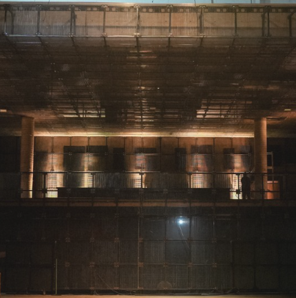
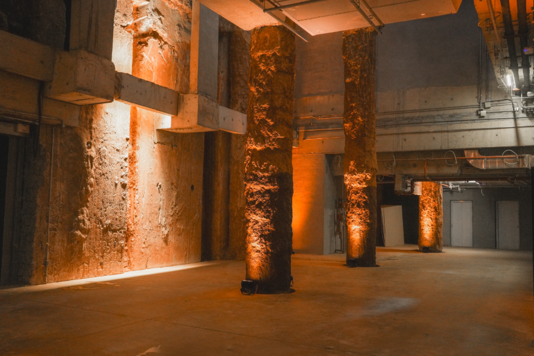
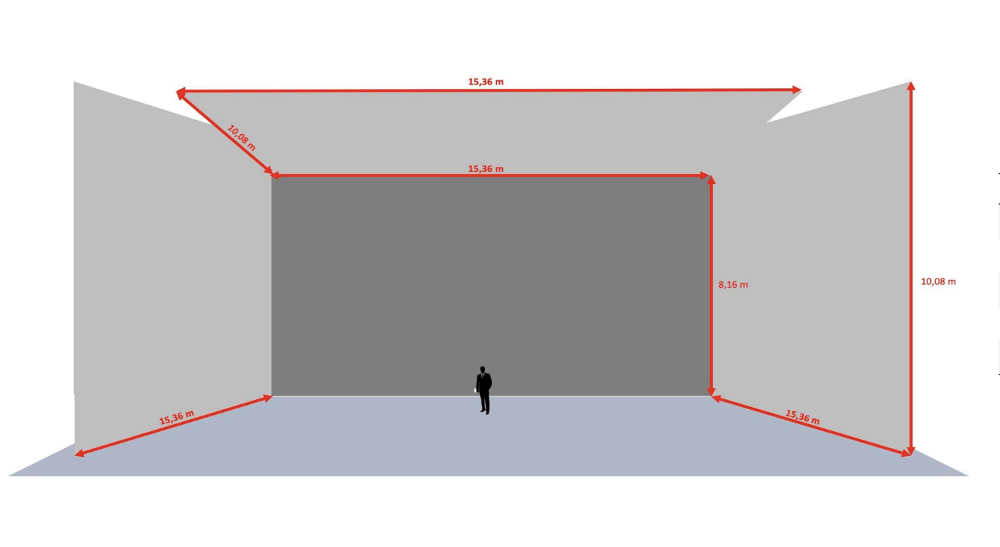
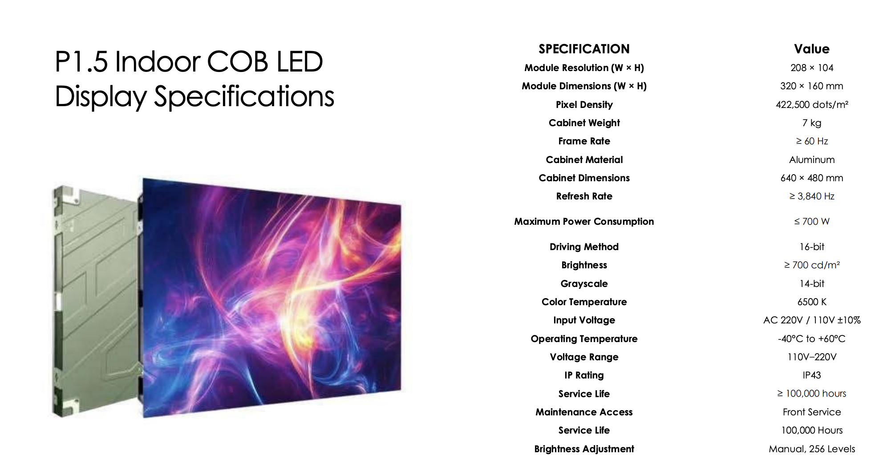

# TÉRA — Briefing & Informações (respostas do cliente)

> Transcrição fiel de **"Téra_The Force_Informações 21.08"** (PDF, 4 páginas), enviado pelo cliente em 21.08.2026.
> Original em `originais/2026-08-21_Tera_The-Force_Informacoes.pdf`. Imagens em `midia/`.
> Formato do documento: perguntas da The Force, respostas do cliente marcadas com **R:**.
> Onde o cliente não respondeu, está marcado **[SEM RESPOSTA]** — a pergunta consta no PDF sem "R:".

*Nota de confidencialidade do próprio documento: "Todas as informações são confidenciais e devem ser compartilhadas apenas com pessoas essenciais ao desenvolvimento do projeto."*

---

## Direcionamentos Gerais

> "Falamos sobre a construção de dois caminhos visuais, sendo um deles ligado à arquitetura da Sala. Aqui, a grande inspiração estética estaria nos formatos quadrados e retangulares da Sala, presentes na composição das telas de Led, do espaço e das grades que revestem paredes, guarda-corpo das escadas e balcão."

---

## 1 — Fotos e vídeos

Pedido da The Force (lista de material a ser produzido/enviado):

- Telas ligadas de outros ângulos: outras faces do cubo, centro da sala, close da imagem na tela, aberto pegando o público, cadeiras etc.
- Sala com telas desligadas, com a trama das grades aparente.
- Entrada subterrânea: close da textura dos pilares de terra, planos abertos do percurso de descida e vídeo do trajeto, se houver.
- Materiais do percurso: piso, paredes, iluminação.

> "O que não existir, registro de celular resolve."

**[SEM RESPOSTA]** — o PDF não registra devolutiva do cliente sobre este item.

---

## 2 — Projeto 3D e desenhos

Pedido da The Force:
- Modelo 3D no formato que tiverem (Revit, SketchUp, IFC, FBX, OBJ, GLB).
- Plantas, cortes e elevações em escala (DWG ou PDF).

**[SEM RESPOSTA]** direta neste documento. *(Ver item 5: a resposta sobre dimensões internas remete a "a Planta enviada" — a planta não acompanha este PDF.)*

---

## 3 — A trama das grades

**P:** As grades são estrutura de sustentação, malha dos módulos de LED, ou ambas?

**R:** "As grades são um revestimento da Sala. Nas paredes laterais, guarda-corpo da escada e etc temos as paredes de concreto aparente, revestidas por essas chapas gradeadas de **1x1m**."

**P:** Desenho ou foto de detalhe, com a dimensão do módulo e o padrão geométrico.

**R:** [foto — sem desenho cotado]

*`midia/sala_grades-trama.png` — interior da sala com o revestimento gradeado aparente, balcão e vigas, em penumbra.*

---

### Os pilares de terra

**P:** Os pilares de terra: taipa, solo aparente ou revestimento? Ficam aparentes na versão final?

**R:** "Os pilares presentes na entrada da Sala, e são os **pilares originais da fundação do antigo Hospital Matarazzo**. Durante o processo de restauro, parte dessas estruturas foi **escavada à mão**, para manter a integridade da estrutura original."

*`midia/entrada_pilares-de-terra.png` — foyer subterrâneo: pilares de terra/solo aparente, textura escavada, luz âmbar rasante, concreto e instalações aparentes.*

---

## 4 — O cubo e a especificação das telas

**P:** Quantas faces são tela (paredes, teto, piso?), dimensões de cada face e área total em m².

**R:** "São **4 telas** — fundo, paredes laterais e teto. Medidas abaixo."

*`midia/sala_medidas-telas.png` — diagrama esquemático em perspectiva, com as cotas em vermelho.*

**Cotas como aparecem no diagrama:**

| Onde a cota aparece | Valor |
|---|---|
| Tela de fundo — largura | 15,36 m |
| Tela de fundo — altura | 8,16 m |
| Teto — largura (aresta do fundo) | 15,36 m |
| Teto — diagonal de profundidade | 10,08 m |
| Laterais — base (linha do piso) | 15,36 m (cada) |
| Lateral — vertical na aresta externa | 10,08 m |

**Área total em m²:** [SEM RESPOSTA] — não informada.

> **Ponto a confirmar com o cliente:** as cotas de 15,36 m e 10,08 m aparecem em posições que admitem mais de uma leitura (profundidade da sala × comprimento das laterais). Confirmar largura × altura de cada uma das 4 faces, individualmente.

**P:** Superfície contínua ou módulos com emendas?

**R:** "Módulos com emendas."

**P:** Dimensão do módulo. Resolução total e por face — e o que o "32K" designa. Pixel pitch, fabricante/modelo/integrador, brilho, gama de cor, taxa de atualização.

**R:** [ficha técnica do módulo — abaixo]

*`midia/led_spec-p1-5-cob.png` — ficha "P1.5 Indoor COB LED Display Specifications".*

| Especificação | Valor |
|---|---|
| Resolução do módulo (L × A) | 208 × 104 px |
| Dimensões do módulo (L × A) | 320 × 160 mm |
| Densidade de pixels | 422.500 dots/m² |
| Dimensões do gabinete | 640 × 480 mm |
| Peso do gabinete | 7 kg |
| Material do gabinete | Alumínio |
| Frame rate | ≥ 60 Hz |
| Refresh rate | ≥ 3.840 Hz |
| Consumo máximo | ≤ 700 W |
| Driving method | 16-bit |
| Brilho | ≥ 700 cd/m² |
| Grayscale | 14-bit |
| Temperatura de cor | 6.500 K |
| Tensão de entrada | AC 220V / 110V ±10% (faixa 110V–220V) |
| Temperatura de operação | −40 °C a +60 °C |
| IP | IP43 |
| Vida útil | ≥ 100.000 horas |
| Manutenção | Front service |
| Ajuste de brilho | Manual, 256 níveis |

**Não respondidos neste item:** resolução total e por face; **o que exatamente o "32K" designa**; fabricante/modelo/integrador.

---

## 5 — A sala como espaço

**P:** Dimensões internas e pé-direito.
**R:** "Consultar a Planta enviada." *(a planta não acompanha este PDF)*

**P:** Público: sentado, em pé, ou varia por obra? Lotação e configurações.
**R:** "A capacidade da sala varia de acordo com os formatos propostos, que vão de **show com plateia em pé (~1.200 pessoas)** a **jantares à mesa (~300 pessoas)**."

**P:** O que não é tela: piso, estrutura, acabamentos.
**R:** **[SEM RESPOSTA]**

**P:** Trajeto de chegada completo (rua → drop-off → portas → sala) e sua iluminação.
**R:** "A sala terá diferentes entradas, uma vez que a pessoa pode descer em diferentes pontos do complexo Mata São Paulo e então caminhar até a nossa entrada. A entrada que será considerada como principal, e por onde **obrigatoriamente todo o público passará, será o Drop-Off**. Nele, a pessoa chega de carro diretamente pela **Rua Itapeva** e desce já neste grande foyer – entrando pela porta à direita da imagem. Nesse espaço entre as colunas serão montadas as estruturas de acesso, de forma volante e com volume de filas e controladores de acesso pensados de acordo com a demanda de cada evento."

> **Pendência:** o texto cita "a porta à direita da imagem", mas **a imagem do Drop-Off não consta no PDF**. Solicitar.

**P:** Crédito do projeto arquitetônico.
**R:** "O projeto arquitetônico em si foi pensado pelo **time interno** que cuida de todo o complexo. **Não há um escritório ou alguma assinatura externa.**"

---

## 6 — Sobre a programação

**P:** As obras da Téra serão criadas e encomendadas especialmente para a sala (obras inéditas, comissionadas), a sala vai receber espetáculos e obras que já existem (programação/booking), ou um mix dos dois?

**R:** "A sala receberá uma **programação variada**, passando inicialmente por:

- **Exposições Imersivas**
- **Espetáculos Musicais ao Vivo**, seja com apresentações e visuais comissionados e criados apenas para a ocasião ou adaptações de projetos alinhados ao conceito e curadoria que estão sendo desenvolvidos. Falamos sobre adaptações porque entendemos que toda apresentação ou visual já existente precisará de ajustes para funcionar bem aqui.
- **Festas e apresentações de música eletrônica**, sejam elas comissionadas ou adaptações. Aqui, há a proposta de se pensar uma **construção visual por temporadas, criando uma narrativa visual proprietária da Sala, que será interpretada por cada DJ/Artista**. Temas e curadoria ainda estão em desenvolvimento.
- **Eventos corporativos.**"

---

*Fim da transcrição. 4 páginas, sem mais conteúdo no original.*
